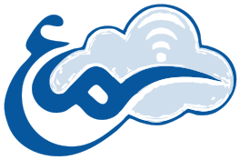

<div align="center">



**ساخته شده توسط [سماع رایانه کیش](https://kishwifi.com)**

</div>

---

# 🖥️ SignageCMS — Digital Signage Management System

> سیستم مدیریت تابلوی دیجیتال حرفه‌ای برای فرودگاه‌ها، هتل‌ها، رستوران‌ها، فروشگاه‌ها و محیط‌های شرکتی
>
> Developed by **[سماع رایانه کیش — Sama Rayaneh Kish](https://kishwifi.com)** | 🌐 [kishwifi.com](https://kishwifi.com)

[](https://php.net)
[](https://mysql.com)
[](LICENSE)
[](https://github.com/kish210/hotel-media/releases/latest)
[](https://kishwifi.com)

---

## 📥 دانلود

### 🏨 برای نصب سرور (پیشنهادی — بدون هیچ دانش فنی)

<div align="center">

### [⬇️ دانلود Setup-HotelMedia.exe](https://github.com/kish210/hotel-media/releases/latest/download/Setup-HotelMedia.exe)

**نصب‌کننده‌ی فارسی تک‌فایل — فقط دابل‌کلیک کنید**

</div>

بدون دیتابیس، بدون تنظیمات. همه‌چیز (وب‌سرور، دیتابیس، سرور real-time) داخل خود
فایل بسته‌بندی شده و به‌صورت **سرویس ویندوز** خودکار نصب می‌شود. بعد از پایان، آیکون روی دسکتاپ
ساخته می‌شود و پنل خودکار باز می‌شود. مناسب کاربری که حتی نمی‌داند دیتابیس چیست.

### همه‌ی فایل‌ها

| پلتفرم | فایل | توضیح |
|--------|------|-------|
| 🏨 **Server — هتل مدیا (فارسی)** | [⬇️ Setup-HotelMedia.exe](https://github.com/kish210/hotel-media/releases/latest/download/Setup-HotelMedia.exe) | ⭐ Windows — تک‌فایل، UI فارسی، کاملاً خودکار |
| 🟢 **Server — All-in-One** | [⬇️ SignageCMS-setup.exe](https://github.com/kish210/hotel-media/releases/latest/download/SignageCMS-setup.exe) | Windows 10/11 / Server — دابل‌کلیک، انگلیسی |
| 🤖 **Android / Android TV** | [⬇️ APK](https://github.com/kish210/hotel-media/releases/latest/download/SignageCMS-android.apk) | Android 5.0+ — نصب مستقیم |
| 🖥️ **Windows Player** | [⬇️ EXE](https://github.com/kish210/hotel-media/releases/latest/download/SignageCMS-windows-player-setup.exe) | Windows 10/11 — پلیر |

> 📦 **همه نسخه‌ها و تاریخچه:** [github.com/kish210/hotel-media/releases](https://github.com/kish210/hotel-media/releases)
>
> ✅ **آخرین نسخه:**  — نصب‌کننده‌ی فارسی هتل مدیا + All-in-One + Android + Windows Player

---

## ✨ امکانات

| ماژول | توضیح |
|-------|-------|
| 📺 **Multi-Screen** | مدیریت نامحدود صفحه‌نمایش با monitoring real-time |
| 🎬 **Playlist Designer** | ساخت پلی‌لیست drag & drop با transition |
| 🎨 **Layout Designer** | طراحی بصری multi-zone |
| 🗓️ **Content Scheduling** | زمان‌بندی روزانه / هفتگی / همیشه |
| ✈️ **FIDS Module** | دریافت خودکار اطلاعات پرواز از fids.airport.ir |
| 🍽️ **Restaurant Menu** | تابلوی منوی دیجیتال |
| 🏨 **Hotel Module** | اطلاعات هتل، خدمات، رویدادها |
| 🏢 **Corporate Module** | اطلاعیه و KPI شرکتی |
| 🛍️ **Retail Module** | تابلوهای فروشگاهی و تبلیغاتی |
| 📡 **WebSocket Real-time** | دستورات آنی از سرور به پلیر |
| 🚨 **Emergency Broadcast** | ارسال پیام اضطراری به همه صفحات |
| 🔗 **Cookie Player Binding** | آدرس ثابت `/player/` برای همه دستگاه‌ها |
| 👥 **Role-Based Access** | کنترل دسترسی ۵ سطح |
| 🌐 **REST API** | API کامل برای Android TV و اپ موبایل |
| 🇮🇷 **Persian RTL** | پشتیبانی کامل فارسی و RTL |

---

## ⭐ نصب (ساده‌ترین راه برای کاربر غیرفنی)

سه راه دارید — هیچ‌کدام به تنظیم دستی دیتابیس نیاز ندارند:

| روش | چه‌کاری بکنید | مناسب چه‌کسی |
|-----|--------------|--------------|
| 🏨 **نصب‌کننده هتل مدیا (فارسی)** | [`Setup-HotelMedia.exe`](https://github.com/kish210/hotel-media/releases/latest/download/Setup-HotelMedia.exe) را دابل‌کلیک کنید | کاربر کاملاً غیرفنی — UI فارسی، نام هتل، آیکون دسکتاپ، Tray فارسی |
| 🟢 **نصب‌کننده All-in-One (انگلیسی)** | [`SignageCMS-setup.exe`](https://github.com/kish210/hotel-media/releases/latest/download/SignageCMS-setup.exe) را دابل‌کلیک کنید | همان تجربه، بدون برند هتل |
| 🟢 **اجرا روی همین پوشه** | فایل سرور را extract کنید و روی **`SETUP-NO-DOCKER.bat`** دابل‌کلیک کنید | وقتی فایل‌های سرور را دارید و می‌خواهید همین‌جا نصب شود |

**نصب‌کننده‌ها چه می‌کنند؟** یک PHP + MariaDB قابل‌حمل را بسته‌بندی/دانلود می‌کنند، پورت آزاد را
خودکار پیدا می‌کنند، دیتابیس و اسکیما و کاربر ادمین را می‌سازند، و وب‌سرور + وب‌سوکت + دیتابیس را
به‌عنوان **سرویس ویندوز** (اجرای خودکار هنگام بوت) ثبت می‌کنند. تمام خطاها فقط در فایل لاگ ذخیره
می‌شوند و در صورت شکست، نصب به‌طور خودکار پاک‌سازی (rollback) می‌شود.

جزئیات ساخت نصب‌کننده‌ها: [نصب‌کننده هتل مدیا](installer/hotelmedia/README.md) · [نصب‌کننده All-in-One](installer/native/README.md)

`SETUP-NO-DOCKER.bat` به‌صورت خودکار یک PHP + MariaDB قابل‌حمل را دانلود می‌کند، دیتابیس را می‌سازد و وب‌سرور + وب‌سوکت + دیتابیس را به‌عنوان **سرویس ویندوز** (با اجرای خودکار هنگام بوت) نصب می‌کند. بعد از نصب، داشبورد روی `http://localhost/admin` باز می‌شود.

```powershell
# یا از PowerShell (Run as Administrator):
.\setup-native.ps1            # نصب
.\setup-native.ps1 -Port 8080 # نصب روی پورت دلخواه
.\setup-native.ps1 -Uninstall # حذف سرویس‌ها
```

جزئیات بیشتر: [installer/native/README.md](installer/native/README.md)

---

## 🚀 نصب سریع (دستی)

### پیش‌نیاز
- **PHP 8.1+** با افزونه‌های `pdo_mysql`، `mbstring`، `gd`، `zip`، `sockets`
- **MySQL 8** یا **MariaDB 10.6+**
- **Composer**

```bash
# 1. Clone
git clone https://github.com/kish210/hotel-media.git
cd hotel-media

# 2. Environment
cp .env.example .env
# ویرایش .env — رمز DB، JWT_SECRET و ...

# 3. وابستگی‌ها
composer install --no-dev --optimize-autoloader

# 4. دیتابیس (اسکیما + داده اولیه + کاربر ادمین)
php artisan db:migrate
php artisan db:seed

# 5. اجرا
php -S 0.0.0.0:80 -t public public/index.php   # وب‌سرور
php websocket/server.php                        # سرور real-time (ترمینال جدا)
```

> روی لینوکس می‌توانید به‌جای مرحله‌های ۲ تا ۵ از `bash install.sh` استفاده کنید.
> روی ویندوز، نصب‌کننده‌های بالا همه‌ی این مراحل را خودکار انجام می‌دهند.

**آدرس‌ها پس از نصب:**

| سرویس | آدرس |
|-------|------|
| 🎛️ Admin Panel | http://localhost/admin/dashboard |
| 📺 Player | http://localhost/player/ |
| 🗄️ phpMyAdmin | http://localhost:8081 |
| 🔌 WebSocket | ws://localhost:8080 |

**ورود پیش‌فرض:**
- Email: `admin@signagecms.com`
- Password: `Admin@123456`

---

## 📺 راه‌اندازی صفحه‌نمایش

### آدرس ثابت — همه دستگاه‌ها
همه صفحات‌نمایش از یک آدرس ثابت استفاده می‌کنند:

```
http://your-server/player/
```

### روش اتصال (Cookie-Based Binding)
1. مرورگر / TV را به `http://server/player/` ببرید  
2. کد فعال‌سازی را از **Admin → Screens → Activation** دریافت کنید  
3. کد را در صفحه pairing وارد کنید  
4. Cookie با مدت ۱ سال ذخیره می‌شود — دفعات بعد مستقیم پلیر باز می‌شود

```
/player/        ← اگر cookie دارد: پلیر
                ← اگر نه: صفحه ورود کد
/player/SCRXXXX ← URL مستقیم (cookie را هم ست می‌کند)
```

---

## ✈️ ماژول FIDS

دریافت خودکار اطلاعات پرواز از [fids.airport.ir](https://fids.airport.ir):

```
Admin → Modules → FIDS → تنظیمات
```

**قابلیت‌ها:**
- دریافت فوری با یک کلیک (Fetch Now)
- Cron Job برای به‌روزرسانی خودکار (هر N دقیقه)
- پشتیبانی از HTTP proxy (برای سرورهای خارج ایران)
- بررسی وضعیت اتصال با latency

**تنظیمات `.env`:**
```env
FIDS_TIMEOUT=10         # timeout به ثانیه
FIDS_CACHE_TTL=60       # کش به ثانیه
FIDS_HTTP_PROXY=        # proxy ایران (اگه سرور خارج باشه)
```

**Cron Job:**
```bash
*/5 * * * * curl -s "http://your-server/api/v1/fids/cron-sync?token=YOUR_TOKEN" > /dev/null
```

---

## 📁 ساختار پروژه

```
signage-cms/
├── app/
│   ├── Controllers/
│   │   ├── Api/              # REST API endpoints
│   │   └── Web/              # Admin panel controllers
│   ├── Core/                 # Framework core (Router, DB, Auth, JWT)
│   ├── Models/               # Database models
│   ├── Middleware/           # Auth, CSRF, Rate limit
│   ├── Modules/              # FIDS, Hotel, Retail, Corporate, Menu
│   └── Services/             # AirportIrFetcher, WebSocket, ...
├── config/                   # App & DB config
├── database/
│   ├── migrations/           # SQL schema
│   └── seeds/                # Sample data
├── docs/                     # API documentation
├── public/                   # Web root
│   ├── index.php
│   ├── assets/               # CSS, JS
│   └── uploads/              # رسانه‌های آپلود شده
├── resources/views/          # PHP templates (admin + player)
│   └── player/
│       ├── pair.php          # صفحه pairing (cookie-based)
│       ├── not_found.php     # 404 پلیر
│       └── profiles/         # modern, android_tv, lg_tv, kiosk, ...
├── routes/
│   ├── web.php               # Web + player routes
│   └── api.php               # API routes
```

---

## 🔌 API خلاصه

**Base URL:** `http://server/api/v1`  
**Auth:** `Authorization: Bearer <JWT>`

```bash
# Login
POST /api/v1/auth/login
{ "email": "...", "password": "..." }

# Screens
GET  /api/v1/screens
POST /api/v1/screens/{code}/heartbeat
GET  /api/v1/screens/{code}/playlist

# Player binding
GET  /player/                   # صفحه pairing (بدون auth)
GET  /player/{SCRXXXXX}         # bind + پلیر
POST /player/activate           # فعال‌سازی با activation code

# FIDS
GET  /api/v1/fids/ping?airport_id=2    # بررسی اتصال
POST /api/v1/fids/sync-live            # fetch + ذخیره (auth)
GET  /api/v1/fids/cron-sync?token=...  # cron (بدون auth)
GET  /api/v1/fids/live?airport_id=2    # خواندن از cache
```

📄 **مستندات کامل API:** [`docs/API.md`](docs/API.md)

---

## 🖥️ نیازمندی‌های سرور

### مصرف پایه سیستم (بدون کلاینت)

| سرویس | RAM |
|-------|-----|
| Nginx | ~50 MB |
| PHP-FPM | ~300 MB |
| WebSocket Server | ~50 MB |
| MySQL 8 | ~350 MB |
| Redis | ~30 MB |
| **جمع پایه** | **~800 MB** |

### منابع به‌ازای هر ۵ کلاینت

| منبع | اضافه می‌شود | توضیح |
|------|------------|-------|
| RAM | +200 MB | WebSocket × 5 + PHP sessions |
| CPU | +5–10% | polling هر ۳۰ ثانیه + heartbeat |
| Bandwidth | **+25 Mbps** | هر کلاینت ویدیو ۱۰۸۰p ≈ 5 Mbps |

### توصیه عملی

| تعداد صفحه | CPU | RAM | SSD | اینترنت (Upload) |
|-----------|-----|-----|-----|-----------------|
| **۵ صفحه (حداقل)** | 2 هسته | 2 GB | 40 GB | 30 Mbps |
| **۵ صفحه (پیشنهادی)** | 2 هسته | 4 GB | 100 GB | 50 Mbps |
| **۲۰ صفحه** | 4 هسته | 6 GB | 200 GB | 100 Mbps |
| **۵۰ صفحه** | 8 هسته | 12 GB | 500 GB | 250 Mbps |

### مصرف پهنای باند بر اساس نوع محتوا

| نوع محتوا | هر کلاینت | ۵ کلاینت | ۲۰ کلاینت |
|-----------|----------|----------|----------|
| تصویر / اسلاید | < 1 Mbps | ~3 Mbps | ~10 Mbps |
| ویدیو 720p | ~2 Mbps | ~10 Mbps | ~40 Mbps |
| ویدیو 1080p | ~5 Mbps | ~25 Mbps | ~100 Mbps |
| ویدیو 4K | ~20 Mbps | ~100 Mbps | ~400 Mbps |

> 💡 اگر کلاینت‌ها ویدیو را **یک‌بار دانلود و کش** کنند، مصرف bandwidth به‌شدت کاهش می‌یابد.

---

## ⚙️ متغیرهای محیطی

```env
APP_NAME=SignageCMS
APP_URL=http://localhost
APP_DEBUG=false
APP_TIMEZONE=Asia/Tehran

DB_HOST=mysql
DB_PORT=3306
DB_DATABASE=signage_cms
DB_USERNAME=signage_user
DB_PASSWORD=StrongPassword123!

JWT_SECRET=your-super-secret-32-char-min-key
JWT_EXPIRY=86400

WS_HOST=0.0.0.0
WS_PORT=8080
WS_ALLOWED_ORIGINS=*

REDIS_HOST=redis
REDIS_PORT=6379

# FIDS Module
FIDS_TIMEOUT=10
FIDS_CACHE_TTL=60
FIDS_HTTP_PROXY=          # http://proxy-ip:port (برای سرور خارج ایران)
```

---

## 🔐 سطوح دسترسی

| نقش | دسترسی |
|-----|--------|
| `super_admin` | همه چیز |
| `admin` | همه به جز tenant management |
| `manager` | صفحات، پلی‌لیست، رسانه |
| `editor` | رسانه، پلی‌لیست |
| `viewer` | فقط خواندن |

---

## 🛠️ تکنولوژی‌ها

- **Backend:** PHP 8.2, MVC (no framework)
- **Database:** MySQL 8
- **Cache:** Redis
- **Real-time:** Ratchet WebSocket
- **Auth:** JWT + Session (dual)
- **Runtime:** PHP built-in server / Nginx (سرویس ویندوز)
- **Player Profiles:** modern, android_tv, lg_tv, samsung_tv, kiosk, minimal, legacy

---

## 📋 Changelog

### v1.8.0 — نسخه‌ی کامل (Complete Package)
- 🏨 **نصب‌کننده‌ی فارسی هتل مدیا** — `Setup-HotelMedia.exe`: تک‌فایل، UI فارسی RTL، صفحه‌ی نام هتل، بدون هیچ پیش‌نیاز، سرویس‌های خودکار، Tray فارسی، صفحه‌ی welcome، rollback و uninstaller با سوال «حذف داده‌ها؟»
- 🟢 **نصب‌کننده‌ی All-in-One** — `SignageCMS-setup.exe`: PHP + MariaDB بسته‌بندی‌شده
- 🖥️ **نصب درجا** — `SETUP-NO-DOCKER.bat` / `setup-native.ps1`
- 🔧 پایداری نصب: رفع باگ بحرانی `$Args` (سرویس‌ها حالا واقعاً روی پورت listen می‌کنند)، سازگاری کامل PowerShell 5.1 / Windows Server (UTF-8 BOM)، مدیریت خطای native commands، ریدایرکت `/admin`
- 🌐 یافتن خودکار پورت آزاد + Windows Firewall خودکار

### v1.6.0
- ✅ اجرای خودکار استک هنگام بوت سرور (Scheduled Task)
- ✅ نصب‌کننده Windows 10/11 — `setup-windows.ps1` + `START.bat`
- ✅ Sama Rayaneh Kish (سماع رایانه کیش) branding
- ✅ زیرساخت انتشار در Google Play و App Store
- ✅ لینک‌های دانلود پایدار — همیشه به آخرین release

### v1.5.1
- ✅ Android Player — fix Java package import errors (UpdateService, MainActivity)
- ✅ Windows Player — fix CI rename step با absolute path
- ✅ VOD — تبدیل خودکار ویدیو به فرمت TS + محدودیت ۵ گیگابایت
- ✅ GitHub Actions — ارتقاء به Node.js 24 (checkout@v6, upload-artifact@v7)
- ✅ Release pipeline — ساخت خودکار APK + EXE + ZIP با یک tag

### v1.5.0
- ✅ Cookie-based screen binding — آدرس ثابت `/player/` برای همه دستگاه‌ها
- ✅ FIDS auto-sync از fids.airport.ir با Cron Job
- ✅ صفحه pairing با کد فعال‌سازی
- ✅ Fix: trailing slash 404 در Router
- ✅ Fix: JSON body در `Request::input()` برای PUT/POST
- ✅ بروزرسانی دکمه refresh پروازها با نمایش خطا

### v1.4.x
- ✅ IPTV & In-Flight Display modules
- ✅ Media transcoder
- ✅ VOD module
- ✅ Screen groups

### v1.3.0
- ✅ FIDS module اولیه
- ✅ Emergency broadcast
- ✅ Android TV player profile

---

## 📄 License

MIT License — See [LICENSE](LICENSE)

---

<div align="center">

---


**[سماع رایانه کیش — Sama Rayaneh Kish](https://kishwifi.com)**

Digital Solutions Provider | Kish Island, Iran

🌐 [kishwifi.com](https://kishwifi.com)

---

*Made with ❤️ for digital signage professionals*

</div>
